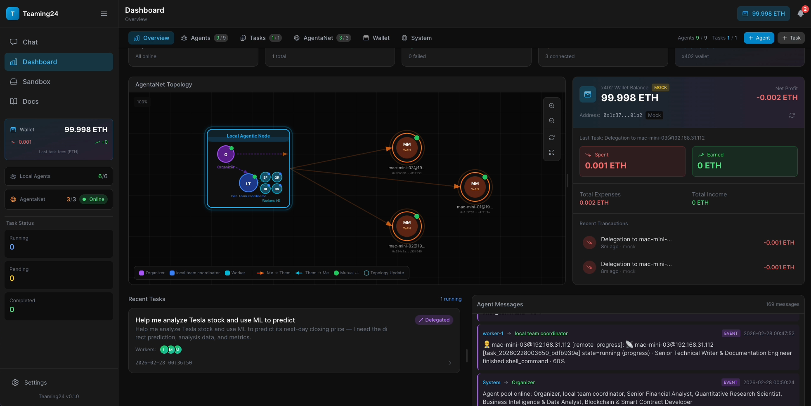

# Teaming24

> Decentralized Agent Swarm Network Prototype for Web4.0

<p align="center">
  <strong>Build, coordinate, and monetize autonomous agent teams across decentralized nodes.</strong><br />
  Agent network runtime + x402 payment rail + observable orchestration stack.
</p>

<p align="center">
  <a href="#quick-start">Quick Start</a> ·
  <a href="docs/">Documentation</a> ·
  <a href="#features">Features</a> ·
  <a href="#open-source-readiness">Open-Source Readiness</a> ·
  <a href="#star-history">Star History</a> ·
  <a href="#contributors">Contributors</a>
</p>

<p align="center">
  <em>Name origin: <strong>Teaming24 = "24 Hours Team Up"</strong>.</em>
</p>

## Overview

Teaming24 is a decentralized platform for running collaborative agentic systems across **Agentic Nodes (AN)**. Nodes discover peers, route tasks, and execute multi-agent workflows without requiring a global central coordinator, while preserving a clear execution and observability model.

Its core mission is to turn personal and organizational AI resources into monetizable network assets through AgentaNet:  
- **Data** (private datasets, domain knowledge, retrieval corpora)  
- **Algorithms** (ML models, model pipelines, multi-agent workflows, reusable skills)  
- **Compute** (execution capacity, sandbox/runtime resources, specialized node capabilities)

Teaming24 provides the coordination layer and payment rail for that market: discovery and routing across Agentic Nodes, plus x402-based settlement for cross-node task execution.

This project is inspired by our ICML 2025 workshop paper and currently implements a practical subset of that decentralized agent-swarm vision:

Paper: [Vision: How to Fully Unleash the Productivity of Agentic AI? Decentralized Agent Swarm Network](https://openreview.net/pdf?id=uQsxYDKmoQ)

```bibtex
@inproceedings{sun2025vision,
  title={Vision: How to Fully Unleash the Productivity of Agentic AI? Decentralized Agent Swarm Network},
  author={Sun, Rui and Wang, Zhipeng and Sun, Jiahao and Ranjan, Rajiv},
  booktitle={ICML 2025 Workshop on Collaborative and Federated Agentic Workflows},
  year={2025}
}
```

## Project Introduction

Teaming24 is an open-source Web4.0 prototype for decentralized agent economies. It combines a FastAPI control plane, a React operations dashboard, pluggable agent tooling, peer-to-peer node discovery, and an x402-native payment component for AN-to-AN value exchange. The project is designed as a practical foundation for production-grade multi-agent coordination, where data, algorithms, and compute can be exposed as services and monetized across the network.



## Design Principles

- **Sovereign nodes, not centralized tenancy** — Every Teaming24 instance is an independent Agentic Node with its own identity, policies, and wallet.
- **Organizer-driven network routing** — Routing is decided by the Organizer through ANRouter planning; the router is a decision layer, not a dispatcher.
- **Capability-first peer selection** — Local and remote coordinators are treated as equal peers in one workforce pool and selected by capability match.
- **Framework-agnostic execution core** — Routing, events, and orchestration modules remain decoupled from any single agent framework implementation.
- **Payment-aware delegation by default** — Cross-node execution is designed to work with x402 settlement so task exchange and value exchange are aligned.
- **Observable-by-design runtime** — SSE/WebSocket streams, event buffers, and structured logs provide auditable end-to-end execution traces.

```
┌─────────────────────────────────────────────────────────────┐
│                      AgentaNet Network                       │
├─────────────────────────────────────────────────────────────┤
│                                                              │
│   ┌──────────────┐     ┌──────────────┐     ┌────────────┐  │
│   │  Agentic     │     │  Agentic     │     │  Agentic   │  │
│   │  Node (AN)   │◄───►│  Node (AN)   │◄───►│  Node (AN) │  │
│   │              │     │              │     │            │  │
│   │ ┌──────────┐ │     │ ┌──────────┐ │     │ ┌────────┐ │  │
│   │ │Organizer │ │     │ │Coordinator│ │    │ │Worker  │ │  │
│   │ │Coordinator│ │    │ │Worker     │ │    │ │Worker  │ │  │
│   │ │Worker    │ │     │ │Worker     │ │    │ └────────┘ │  │
│   │ └──────────┘ │     │ └──────────┘ │     │            │  │
│   └──────────────┘     └──────────────┘     └────────────┘  │
│           │                    │                    │        │
│           └────────────────────┴────────────────────┘        │
│                        x402 Payments                         │
└─────────────────────────────────────────────────────────────┘


User Request
     ↓
┌─────────────────────┐
│     Organizer       │  ← Receives user request, routes to Coordinator
│   (Manager Agent)   │
└──────────┬──────────┘
           ↓
┌─────────────────────┐
│    Coordinator      │  ← Breaks down task, assigns to Workers
│  (Team Manager)     │
└──────────┬──────────┘
           ↓
┌─────────────────────┐
│      Workers        │  ← Execute sub-tasks
│ (PM, Dev, QA, etc.) │
└──────────┬──────────┘
           ↓
Results flow back up:
Worker → Coordinator → Organizer → User
```

## Features

- **Multi-Agent Orchestration** — Organizer → Coordinator → Worker hierarchy
- **Decentralized Agent Swarm Network** — Connect and collaborate across independent Agentic Nodes
- **x402 Payment Layer** — AN-to-AN settlement via HTTP 402 protocol
- **Skills System** — Bundled + registry-managed skills for reusable agent capabilities
- **Sandboxed Execution** — Docker-isolated runtimes (OpenHands default, native Sandbox optional)
- **Dashboard UI** — Monitor agents, tasks, network, and wallet
- **Task Flow Visualization** — Phase rail + timeline replay + optional topology graph
- **Streaming Chat** — Real-time LLM integration with session management
- **OpenClaw Integration (Optional)** — Feature-flagged integration via `extensions.openclaw.enabled` for OpenClaw channels/tools

## Modular Architecture

Teaming24 uses a plug-and-play design for extensibility:

- **Self-contained modules** — Each module has a clear public API and minimal coupling
- **Register, don't modify** — New features are added by creating a new module and registering it; no changes to existing code required
- **Examples:** adding a new event type in `events/`, a new route module in `api/routes/`, a new tool in `agent/tools/`, or a new skill in `agent/skills/`

## Open-Source Readiness

Use this checklist before publishing:

```bash
# 1) Install runtime dependencies
pip install -r requirements.txt

# 2) Install test dependencies
pip install pytest pytest-asyncio pytest-cov

# 3) Run tests
PYTHONPATH=. pytest

# 4) Optional syntax sanity check
PYTHONPATH=. python -m compileall teaming24 tests
```

If you use `uv`, the equivalent is:

```bash
uv sync --group dev
uv run pytest
```

## Quick Start

### System Requirements

| Platform | Support |
|----------|---------|
| macOS (Apple Silicon M1/M2/M3) | ✅ Primary |
| Linux (Ubuntu 22.04+) | ✅ Primary |
| macOS (Intel) | ⚠️ Limited |
| Windows | ⚠️ WSL2 only |

### Prerequisites

| Dependency | Version | Required For | Install Guide |
|------------|---------|--------------|---------------|
| Python | 3.12+ | Backend | [python.org](https://python.org) |
| Node.js | 18+ | GUI Frontend | [nodejs.org](https://nodejs.org) |
| Docker | 24.0+ | Sandbox Runtime | See below |
| uv | latest | Package Manager | `curl -LsSf https://astral.sh/uv/install.sh \| sh` |

#### Docker Installation

**macOS (Apple Silicon):**
```bash
# Install Docker Desktop (includes Docker CLI)
brew install --cask docker
# Start Docker Desktop from Applications
# Verify: docker --version && docker ps
```

**Linux (Ubuntu):**
```bash
# Install Docker Engine
curl -fsSL https://get.docker.com -o get-docker.sh
sudo sh get-docker.sh
sudo usermod -aG docker $USER
# Logout and login again, then verify
docker --version && docker ps
```

### Install

```bash
# Clone repository
git clone https://github.com/teaming24/teaming24.git
cd teaming24

# Backend dependencies (uv — default, recommended)
uv sync

# Frontend dependencies
cd teaming24/gui && npm install
```

<details>
<summary>Alternative: install with pip</summary>

```bash
python -m venv .venv && source .venv/bin/activate
pip install -r requirements.txt
```
</details>

### Run

```bash
# Option 1: uv (recommended, default)
uv run python main.py            # Backend
cd teaming24/gui && npm run dev   # Frontend (separate terminal)

# Option 2: Dev script (starts both)
./scripts/start_dev.sh

# Option 3: Manual with pip
python main.py --reload           # Backend
cd teaming24/gui && npm run dev   # Frontend (separate terminal)
```

> **Tip:** `uv run` automatically uses the project virtual environment and resolves dependencies. No need to activate a venv manually.

### Access

| Service | URL |
|---------|-----|
| Dashboard (dev server, typical\*) | http://localhost:8088 |
| Dashboard (built frontend) | http://localhost:8000 |
| API | http://localhost:8000/api |
| API Docs | http://localhost:8000/docs |

\* Vite prefers `8088`, then falls back to another available port when occupied.

## Documentation

| Topic | Description |
|-------|-------------|
| [Getting Started](docs/getting-started.md) | Installation and first run |
| [Configuration](docs/configuration.md) | Server, AgentaNet, security settings |
| [x402 Payments](docs/x402-payments.md) | Crypto payment integration |
| [API Reference](docs/api.md) | REST endpoints |
| [Architecture](docs/architecture.md) | System design and concepts |
| [OpenClaw Integration](docs/openclaw.md) | Trigger tasks from chat channels via OpenClaw |

## Project Structure

```
teaming24/
├── main.py                     # Entry point
├── requirements.txt            # Python dependencies
├── teaming24/
│   ├── agent/                  # Agent orchestration layer
│   │   ├── core.py             # LocalCrew orchestrator
│   │   ├── an_router.py        # AN routing strategies
│   │   ├── events.py           # CrewAI event listeners & step callbacks
│   │   ├── factory.py          # Agent creation factory
│   │   ├── crew_wrapper.py     # CrewAI Crew execution wrapper
│   │   ├── tool_policy.py      # Profile-based tool filtering
│   │   ├── framework/          # Framework adapters (native / crewai)
│   │   ├── tools/              # Agent tool implementations
│   │   └── workers/            # Worker agent blueprints
│   ├── api/                    # FastAPI server (modular)
│   │   ├── server.py           # Main app + remaining endpoints
│   │   ├── deps.py             # Shared dependencies & singletons
│   │   ├── state.py            # Mutable in-memory state
│   │   ├── errors.py           # Typed error codes & handlers
│   │   └── routes/             # Plug-and-play route modules
│   │       ├── health.py       # Health, config, docs endpoints
│   │       ├── config.py       # Agent tools, channels, framework
│   │       ├── db.py           # Database CRUD endpoints
│   │       ├── wallet.py       # Wallet & x402 payment endpoints
│   │       ├── scheduler.py    # Cron job management
│   │       └── gateway.py      # Gateway status & execution
│   ├── config/                 # Configuration (single source of truth)
│   │   ├── __init__.py         # Dataclass config loading
│   │   ├── teaming24.yaml      # THE config file (all settings)
│   │   └── validation.py       # Pydantic startup validation
│   ├── events/                 # Typed event bus (pub/sub)
│   │   ├── types.py            # EventType enum
│   │   ├── bus.py              # EventBus (async + sync)
│   │   └── bridge.py           # Thread → asyncio bridge
│   ├── session/                # Session management
│   │   ├── context.py          # Token tracking & auto-compaction
│   │   └── compaction.py       # JSONL transcripts & summarization
│   ├── runtime/                # Sandbox execution environments
│   ├── payment/                # x402 payment protocol
│   ├── communication/          # Network, discovery, messaging
│   ├── gateway/                # Channel → session → agent pipeline
│   ├── memory/                 # Persistent agent memory
│   ├── gui/                    # React dashboard (Vite + Zustand)
│   └── utils/                  # Logging, helpers
├── examples/                   # Demo scripts
└── docs/                       # Documentation
```

## Sandbox Runtime

Teaming24 supports Docker-isolated runtimes for code execution and browser automation:

- **OpenHands runtime** (default backend in `teaming24.yaml`)
- **Native Sandbox runtime** (AIO Sandbox / Docker backend)

Example with the native sandbox API:

```python
from teaming24.runtime import Sandbox

async with Sandbox() as sandbox:
    # Execute commands in isolated container
    result = await sandbox.execute("python script.py")
    
    # Browser automation
    await sandbox.goto("https://example.com")
    screenshot = await sandbox.screenshot()
    
    # VNC live view (in GUI)
    print(f"Watch live: {sandbox.vnc_url}")
```

**Key Features:**
- 🐳 Docker container isolation
- 🖥️ VNC streaming for visual monitoring
- 🌐 Playwright browser automation
- 📁 Secure file system access
- ⚡ Hot sandbox pool (persistent containers)

## Configuration

Primary configuration lives in `teaming24/config/teaming24.yaml` (with optional `.env` overrides).

```yaml
system:
  server:
    host: "0.0.0.0"
    port: 8000
  database:
    path: "~/.teaming24/data.db"
network:
  local_node:
    name: "My Node"
  discovery:
    enabled: true
```

Environment variables (`.env`):

```bash
TEAMING24_LOG_LEVEL=INFO
TEAMING24_RPC_URL=https://sepolia.base.org
TEAMING24_WALLET_ADDRESS=0x...
TEAMING24_WALLET_PRIVATE_KEY=0x...
```

## Star History

[](https://star-history.com/#teaming24/teaming24&Date)

## Contributors

<a href="https://github.com/soraw-ai/teaming24/graphs/contributors">
  
</a>

## Thanks
- https://github.com/openclaw/openclaw
- https://github.com/a2aproject/A2A
- https://github.com/Aider-AI/aider
- https://github.com/google-agentic-commerce/a2a-x402
- https://github.com/agent-infra/sandbox
- https://github.com/alibaba/OpenSandbox
- https://github.com/crewAIInc/crewAI


## Roadmap
- [ ] Human-in-the-loop interfaces and operator workflows.
- [ ] DAO-style decentralized agent benchmarking.
- [ ] Decentralized task verification.
- [ ] ANRouter algorithm
